## はじめに

レバテックSREチームの鈴木です。

現在、レバテックの本番環境では **TiDB Cloud Dedicated Cluster** を利用していますが、運用上の課題として「TiDBノードのメンテナンス（再起動やスケーリング）時に発生する接続断」がありました。
特にOLTPワークロードにおいては、この瞬断がトランザクションエラーを引き起こし、アプリケーション側の可用性に影響します。

この課題を解決するために、TiDBのプロキシコンポーネントである **TiProxy** の導入を行いました。
本記事では、パフォーマンス検証で判明した「正直な性能数値」から、ダウンタイムなしで導入するための「移行戦略」、そして本番適用まで、導入の裏側をすべて公開します。

## TiProxyとは？なぜ導入するのか

最大の導入目的は **Connection Migration（接続移行）** 機能です。

通常、TiDBノードが（再起動やスケールインなどによって）停止すると、そこに接続していたクライアントは切断されてしまいます。しかしTiProxyを挟むことで、バックエンドのTiDBノードが停止しても、TiProxyがクライアントとの接続を維持したまま、別の健全なTiDBノードへセッションをシームレスに移行してくれます。

これにより、**アプリケーション側から見た接続断をゼロにする（接続障害を吸収する）** ことが可能になります。

## 1. 事前検証：パフォーマンスへの正直な向き合い方

プロキシを導入する際、最も懸念されるのが「レイテンシの増加」と「スループットの低下」です。
私たちはSTG環境にて、SysbenchとTPC-Cを用いた徹底的なベンチマークを実施しました。

TiDBノードに直接接続する場合と、TiProxyを有効化した場合でそれぞれベンチマークを実行しました。
以下が検証結果のサマリーです。

| シナリオ | 測定内容 | Direct接続 | TiProxy経由 | 変化率 |
|---|---|---|---|---|
| **Sysbench (Point Select)** | 超高速な単純参照 | 28,464 QPS | 21,850 QPS | **-23.2%** |
| **TPC-C** | 複合トランザクション | 24,237 tpmC | 24,431 tpmC | **+0.8%** |

面白いことにsysbenchでは23.2%の劣化が出たのに対し、TPC-Cでは逆に0.8%のパフォーマンス向上が確認できました。

### なぜこの差が生まれたのか

以下の結論に至りました。

```mermaid
gantt
    dateFormat  s
    axisFormat  %L ms
    title クエリ実行時間におけるオーバーヘッドの比率

    section Sysbench
    DB処理 (2ms)           :active, a1, 0, 2s
    TiProxyオーバーヘッド (0.7ms) :crit, a2, after a1, 0.7s

    section TPC-C
    DB処理 (70ms)          :active, b1, 0, 70s
    TiProxyオーバーヘッド (0.7ms) :crit, b2, after b1, 0.7s
```

1.  **単純クエリ（Point Select）の大幅劣化**
    * 実行時間が約2msと極めて短いクエリに対して、TiProxyの固定オーバーヘッド（約0.7ms）が比率として大きくのしかかりました。
    * 2万QPSを超えるような超高頻度アクセスでは、プロキシの存在がボトルネックになります。

2.  **実ワークロード（TPC-C）の性能向上**
    * 複雑なトランザクション（実行時間 約70ms）においては、プロキシのオーバーヘッドは誤差の範囲（3%程度）に希釈されました。
    * むしろ、TiProxyが持つ「コネクションプーリング」や「ロードバランシング」の効果が上回り、結果としてスループットが **0.8%向上** しました。

### 導入の意思決定

レバテックの本番環境はQPSが平均1,600程度（ピーク2,300）の混合OLTPワークロードです。
「超高頻度な単純クエリ」のみが大量に走る環境ではないため、**「体感可能な性能劣化は発生しない（むしろ安定性は向上する）」** と判断し、導入を決定しました。

## 2. 移行戦略：ダウンタイムなしでどう有効化するか

TiDB Cloud Dedicatedの仕様上、既存のクラスターでそのままTiProxyを有効化しようとすると、NLB（Network Load Balancer）のターゲット切り替えタイミングで新規接続が失敗する瞬間が生まれます。

この点については弊社環境での検証と、PingCapサポートの問い合わせにより以下の事実がわかりました。

>社内での再確認および検証の結果、
>有効化・無効化のいずれの場合も、NLB の Target Group 内で TiDB / TiProxy が同時に draining / initial 状態となるタイミングでは、新規接続が行えない ことが確認されました。
>この挙動により、以下の 2 つのシナリオでアプリケーション側の挙動が異なります。
>TPCC 等の Long Connection（Connection Pool を利用する場合）
>Connection Pool のおかげで、既存コネクションを利用する処理は影響を受けません。
>ただし、運が悪い場合には TiDB / TiProxy が同時に draining / initial となる瞬間に新規接続を試みると、接続失敗が発生する可能性があります。
>PHP 等の Short Connection（Connection Pool を利用しない場合）
>毎回接続を張り直すため、TiDB / TiProxy が同時に draining / initial になるタイミングでは新規接続ができず、影響が大きくなります。
>そのため、もし御社にて PHP のような Short Connection 型のワークロードをご利用の場合は、
>TiDB Node Group 単位でのエンドポイント切り替えによる TiProxy 有効化 のご検討をおすすめいたします。

新機能の提供において、公式サポートでも認識しきれていない問題が発生してしまうことはしょうがないと思います。
今回の対応で、公式からの回答であっても鵜呑みにせず、検証を積み重ねて事実によって合意できたのはとても良かったと思います。

ということで、影響を最小限に抑えるために **「一時Node Group + Route53切り替え方式」** を採用しました。
以下に簡単な切り替えのステップをまとめます。

### Step 1: 一時Node Group作成&接続の切り替え
一時Node Groupを作成しデフォルトノードグループに接続するコネクションを全て退避させます。

### Step 2: デフォルトNode GroupでのTiProxy有効化と接続の切り戻し
完全にアプリケーションからの接続が亡くなったことを確認してデフォルトノードグループでのTiProxy有効化と接続の切り戻しを行います。
接続の切り戻しはプライベートレコードの更新によって行います。

この方式のポイントは以下の通りです。

  * **一時的なコスト増を許容する**: Node Groupを一時的に倍増させるコストよりも、接続断を回避する安全性を優先しました。
  * **Default Node Groupを維持**: TiDB Cloudの制約上、デフォルトのNode Groupは削除できないため、この「退避→有効化→戻す」という手順が必要でした。
  * **残留接続チェック**:接続を切り替える前に、必ず `Connection Count = 0` であることを確認する手順を組み込みました。

## 3\. アプリケーション調査

インフラ側の準備は整いましたが、最大の難関はアプリケーション側にありました。
この切り替え方針において、アプリケーション側のDB接続情報の更新とアプリケーションの再起動が必要になります。

私たちは、DB側で見えている接続情報（`PROCESSLIST`）と、インフラ管理されているアプリケーション（ECS/Secrets Manager）を照合して、本番環境に接続する全ての接続元を特定しました。

Secret Managerで管理されている認証情報や、ECSサービスとして稼働しているアプリケーションは、SREチームでSecret更新、ECSのRolling Updateを実施するスクリプトを組み自動で対応しました。

一部EC2で運用されているアプリケーションやSecretManager外で管理されている認証情報については、各チームに個別にご対応いただきました。
自チームのタスクで忙しいにもかかわらず、どのチームも快くご対応いただいて本当に助かりました。

## 4\. ハマりどころ：PHPとTypeScriptの挙動の違い

PingCapサポートの回答にもあった、言語・フレームワークごとの挙動の違いについても改めて整理しておきます。

### PHP (Short Connection)

レバテックの一部システムはPHPで動作しており、リクエストごとに接続と切断を繰り返す **Short Connection** 方式でした。

DNS切り替え時、TTLが切れた直後のリクエストから新しい接続先を参照するようになります。
このため、PHP製のアプリケーションではStep2のデフォルトノードグループへの接続の切り戻しのタイミングでは、再起動を行わなくても自動的に接続が切り替わります。

### TypeScript (Long Connection)

新しいシステムはコネクションプールを利用しています。

アプリケーション起動時にDNS解決を行い、そのIPで接続プールを作ります。そのため、**Route53でDNSを切り替えても、アプリは古いIP（削除予定の一時Node Group）を見続けてしまいます**。
そのため、DNS切り替え後に、アプリケーションの **Rolling Update（再起動）** が必須となります。

## まとめ

TiProxyの導入は、単に「機能を有効化する」ボタンを押すだけの作業ではありませんでした。

1.  **性能検証**: 固定オーバーヘッドと実ワークロードでの恩恵を天秤にかける。
2.  **移行計画**: クラウドベンダーの仕様と制約を回避するルーティング戦略を練る。
3.  **現状把握**: 接続元（Gap）を特定する。
4.  **アプリ挙動**: 言語ごとの接続特性に合わせた計画を立てる。

これらを一つずつクリアすることで、TiProxy導入を達成することができました。
これからTiProxy導入を検討されている方の参考になれば幸いです。

-----

*※本記事の数値データは検証環境および特定時点での測定結果に基づきます。*
