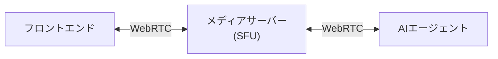

## こんな質問、英語で即答できますか

- "What are the strengths of Go?"
- "What are the four golden signals in SRE?"
- "Tell me about the most challenging technical project you've worked on recently."

半年前、外資IT企業のSRE面接（全編英語）で、僕はこれらに即答できませんでした。日本語なら説明できる内容。なのに英語になった瞬間、頭のキャパが持っていかれて、知ってるはずのことが出てこない。

事前にChatGPTやGeminiと壁打ちして想定問答も練習していました。でも実際の技術面接では手も足も出ませんでした。

この記事では、その挫折から **外資IT面接に特化したAI英会話サービス「Iruka」** を作り始めた話を書きます。

:::message
### 🐬 ウェイトリスト登録(所要1分)

プロトタイプは **完全無料** で公開します。登録いただいた方から順にアクセスをご案内します。

👉 **[https://tally.so/r/q4Werk](https://tally.so/r/q4Werk)**
:::

## こんな人に使ってほしい

- 外資ITのテクニカル面接を控えている / 受けたい
- 英語で技術を語ると頭が真っ白になる
- Speakやネイティブキャンプは試したが、エンジニア面接の文脈では物足りなかった
- 人間のコーチは高くて反復練習しづらい

ひとつでも刺さったら、読んでいただく価値があるかもしれません。

## なぜ既存ツールでは足りなかったか

面接準備で **Speak** のような汎用AI英会話ツールを試しましたが、すぐに辞めてしまいました。
AIが投げてくる質問の質がそもそも違います。

**汎用AI英会話ツール(Speak等)**
- "What did you do last weekend?"
- "Tell me about your hometown."
- "What's your favorite movie?"

**外資ITのテクニカル面接**
- "Walk me through how you'd design a URL shortener for 100M users."
  (1億ユーザーが使うのURL短縮サービスをどう設計するか説明してください)
- "What are the trade-offs between optimistic and pessimistic locking?"
  (楽観的ロックと悲観的ロックのトレードオフは何ですか)
- "Tell me about a time you disagreed with your manager."
  (マネージャーと意見が対立したときのことを話してください)

前者を繰り返しても、後者には答えられるようになりません。**英語力と、英語面接を突破する力は別物**だと思います。

外資系テック企業の面接コンテキストを理解したAI面接官と、何度でも気軽に話せる環境。これが欲しかったけど見つからなかったので、作っています。

## Iruka の概要

シナリオを選んで、AI面接官と英語で技術面接を練習して、終わったらフィードバックをもらうという設計でプロトタイプの開発を進めています。

- **3種類の面接シナリオ**: System Design / Coding & Algorithms / Behavioral
- **AI面接官と音声でリアルタイム会話**: "Could you go deeper into that?" と深掘りしてくる
- **3軸フィードバック**: 英語力 / 技術力 / 面接テクニック をスコアと改善点で返す
- **AI相手なので恥ずかしさゼロ**: 詰まっても、何度でもやり直せる

*3種類の面接シナリオから選択*

*AI面接官と音声でリアルタイムに対話*

## 技術スタック(概要)

- **LiveKit Agents SDK**: WebRTC経由で低遅延な音声通信を実現
- **STT → LLM → TTS パイプライン**: AIエージェント内部で音声をテキスト化→応答生成→音声合成
- **2エージェント構成**: 面接実施の `InterviewerAgent` と、評価の `FeedbackAgent` をハンドオフで切り替え

各コンポーネントの実装詳細は連載で掘り下げていきます。

- 第2回: LiveKit Agents SDKでリアルタイム音声AIエージェントを動かすまで
- 第3回: LLMをツールで制御して「面接の流れ」を設計する
- 第4回: 面接官 → フィードバックAIへのマルチエージェントハンドオフ
- 第5回: Next.js + LiveKit Componentsで面接UIを作る

## 使ってみてくれる人を募集しています

現在プロトタイプを開発中です。初期ユーザーとしてフィードバックをくれる方を探しています。

- 外資IT面接を控えている方 / 受けた経験がある方
- Voice AI / LiveKit に興味がある開発者

:::message
### 🐬 ウェイトリスト登録(所要1分)

プロトタイプは **完全無料** で公開します。登録いただいた方から順にアクセスをご案内します。

👉 **[https://tally.so/r/q4Werk](https://tally.so/r/q4Werk)**
:::

- X: [@hszk_ai](https://x.com/hszk_ai) — 連載記事の更新や開発の進捗をお知らせしています
- GitHub: [hszk-dev](https://github.com/hszk-dev) — 連載のサンプルコードを公開予定です

「こういうシナリオが欲しい」「この評価軸が足りない」といった声を聞きながら育てていきたいです。気軽にコメント・DMいただけると嬉しいです。
